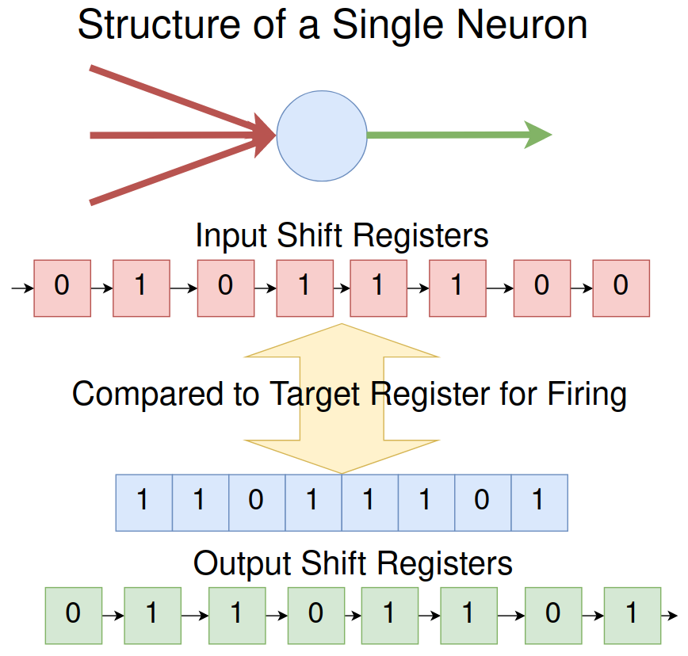

   

Neuronmorphic ASIC with 96 neurons arranged in an 8 neuron by 12 layer grid.
* All 96 Neurons are fully programmable
* There are 8 serial inputs to the neural network directly connected to uio_in[0], uio_in[1], ..., uio_in[7]
* There are 8 serial outputs of the neural network directly connected to uo_out[0], uo_out[1], ..., uo_out[7]
* The Neural network is controlled by ui_in[0], ui_in[1], ..., ui_in[7]
* Over 300 Neural connections in the neural network
* 18470 total cells with 59.09% utilization in TinyTapeout 7 

| Pin Name       | Type         | Connection                           |
|----------------|--------------|--------------------------------------|
| ui[0]/ui_in[0] | Serial Input | Directly connected to input neuron 0 |
| ui[1]/ui_in[1] | Serial Input | Directly connected to input neuron 1 |
| ui[2]/ui_in[2] | Serial Input | Directly connected to input neuron 2 |
| ui[3]/ui_in[3] | Serial Input | Directly connected to input neuron 3 |
| ui[4]/ui_in[4] | Serial Input | Directly connected to input neuron 4 |
| ui[5]/ui_in[5] | Serial Input | Directly connected to input neuron 5 |
| ui[6]/ui_in[6] | Serial Input | Directly connected to input neuron 6 |
| ui[7]/ui_in[7] | Serial Input | Directly connected to input neuron 7 |

* ui[0]/ui_in[0] to ui[7]/ui_in[7] are directly connected to neuron 0 to neuron 7
* Each individual input pin store 8 bits of serial data
* Clocked on rising edge CLK

| Pin Name        | Type          | Connection                      |
|-----------------|---------------|---------------------------------|
| uo[0]/uo_out[0] | Serial Output | Directly connected to neuron 88 |
| uo[1]/uo_out[1] | Serial Output | Directly connected to neuron 89 |
| uo[2]/uo_out[2] | Serial Output | Directly connected to neuron 90 |
| uo[3]/uo_out[3] | Serial Output | Directly connected to neuron 91 |
| uo[4]/uo_out[4] | Serial Output | Directly connected to neuron 92 |
| uo[5]/uo_out[5] | Serial Output | Directly connected to neuron 93 |
| uo[6]/uo_out[6] | Serial Output | Directly connected to neuron 94 |
| uo[7]/uo_out[7] | Serial Output | Directly connected to neuron 95 |

* uo[0]/uo_out[0] to uo[7]/uo_out[7] are directly connected to neuron 88 to neuron 95
* Each individual output pin produces 8 bits of serial data
* Clocked on rising edge CLK

| Pin Name         | Type               | Description                                                     |
|------------------|--------------------|-----------------------------------------------------------------|
| CLK              | Input Clock        | Rising Edge Clock                                               |
| RST_N            | Input Reset        | Set High to program a selected neuron. Low does nothing.        |
| uio[0]/uio_in[0] | Input Program Data | Data for 1-wire serial protocol for programming selected neuron |
| uio[1]/uio_in[1] | Input Address      | Address[0] used to select a single neuron for programming       |
| uio[2]/uio_in[2] | Input Address      | Address[1] used to select a single neuron for programming       |
| uio[3]/uio_in[3] | Input Address      | Address[2] used to select a single neuron for programming       |
| uio[4]/uio_in[4] | Input Address      | Address[3] used to select a single neuron for programming       |
| uio[5]/uio_in[5] | Input Address      | Address[4] used to select a single neuron for programming       |
| uio[6]/uio_in[6] | Input Address      | Address[5] used to select a single neuron for programming       |
| uio[7]/uio_in[7] | Input Address      | Address[6] used to select a single neuron for programming       |

* uio[1]/uio_in[1] to uio[7]/uio_in[7] are used to select a single neuron from the 96 neuron array
* If RST_N is low, then nothing happens. If RST_N is high, then the selected individual neuron enters a programming stage.
* 16 bit serial input to uio[0]/uio_in[0] writes information to the internal registers of the selected neuron
* Clocked on rising edge CLK

* Each neuron has multiple inputs written to an 8 bit input shift register
* If the input shift register matches the 8 bit internal target register then the neuron fires
* Upon firing, the 8 bit output shift register output a predetermined sequence to the next neuron or output of the network

# Tiny Tapeout Verilog Project Template

- [Read the documentation for project](docs/info.md)

## What is Tiny Tapeout?

Tiny Tapeout is an educational project that aims to make it easier and cheaper than ever to get your digital and analog designs manufactured on a real chip.

To learn more and get started, visit https://tinytapeout.com.

## Set up your Verilog project

1. Add your Verilog files to the `src` folder.
2. Edit the [info.yaml](info.yaml) and update information about your project, paying special attention to the `source_files` and `top_module` properties. If you are upgrading an existing Tiny Tapeout project, check out our [online info.yaml migration tool](https://tinytapeout.github.io/tt-yaml-upgrade-tool/).
3. Edit [docs/info.md](docs/info.md) and add a description of your project.
4. Adapt the testbench to your design. See [test/README.md](test/README.md) for more information.

The GitHub action will automatically build the ASIC files using [OpenLane](https://www.zerotoasiccourse.com/terminology/openlane/).

## Enable GitHub actions to build the results page

- [Enabling GitHub Pages](https://tinytapeout.com/faq/#my-github-action-is-failing-on-the-pages-part)

## Resources

- [FAQ](https://tinytapeout.com/faq/)
- [Digital design lessons](https://tinytapeout.com/digital_design/)
- [Learn how semiconductors work](https://tinytapeout.com/siliwiz/)
- [Join the community](https://tinytapeout.com/discord)
- [Build your design locally](https://docs.google.com/document/d/1aUUZ1jthRpg4QURIIyzlOaPWlmQzr-jBn3wZipVUPt4)

## What next?

- [Submit your design to the next shuttle](https://app.tinytapeout.com/).
- Edit [this README](README.md) and explain your design, how it works, and how to test it.
- Share your project on your social network of choice:
  - LinkedIn [#tinytapeout](https://www.linkedin.com/search/results/content/?keywords=%23tinytapeout) [@TinyTapeout](https://www.linkedin.com/company/100708654/)
  - Mastodon [#tinytapeout](https://chaos.social/tags/tinytapeout) [@matthewvenn](https://chaos.social/@matthewvenn)
  - X (formerly Twitter) [#tinytapeout](https://twitter.com/hashtag/tinytapeout) [@tinytapeout](https://twitter.com/tinytapeout)
